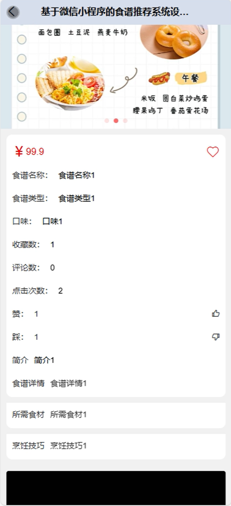
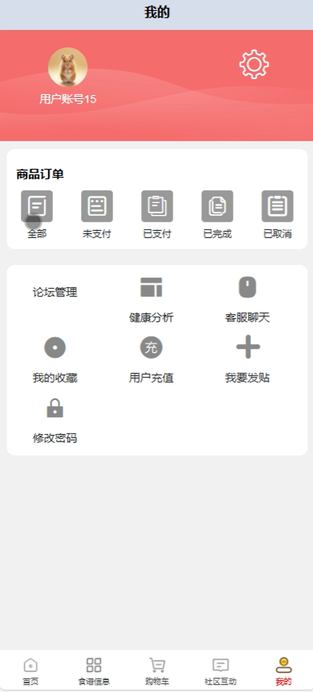
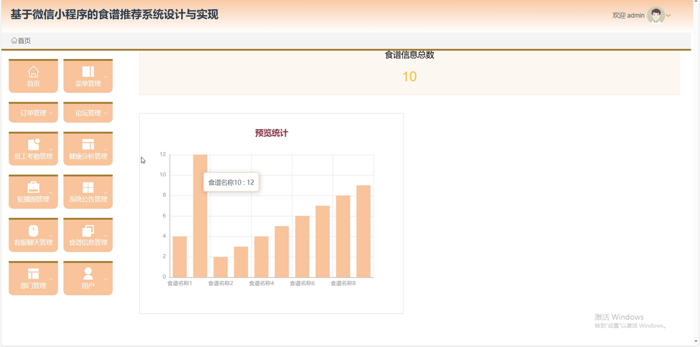
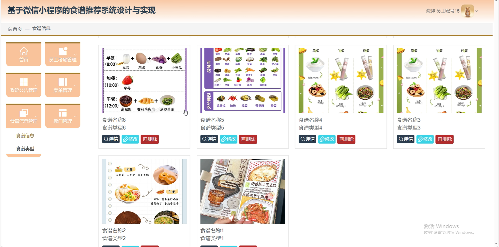
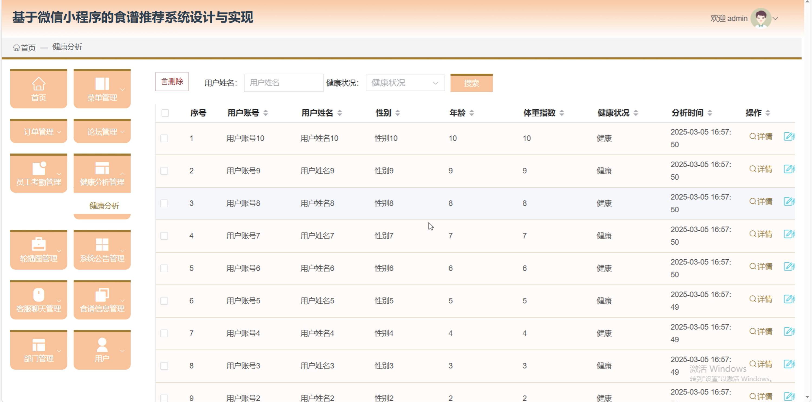

# mpweixinA224D
mpweixinA224D食谱推荐微信小程序+LW
 
## 源码问题查看主页咨询

### 一、关键词
食谱信息管理，健康分析管理，微信小程序

### 二、作品包含
源码+数据库+万字设计文档+全套环境和工具资源+本地部署教程

### 三、项目技术
前端技术： Html、Css、Js、Vue3.0、Element-plus
后端技术：Java、SpringBoot3.0、MyBatis

### 四、运行环境（以下版本亲测，其他版本兼容性请自行测试）
开发工具：IDEA/eclipse  + VSCODE + 微信开发者工具

数据库：MySQL5.7（最低要5.7版本）

数据库管理工具：Navicat10以上版本

环境配置软件： JDK17 + Maven3.6.3

前端Nodejs：20

浏览器：谷歌浏览器

### 五、项目介绍
项目编号：mpweixinA224D

食谱推荐微信小程序，帮助用户轻松获取烹饪灵感与技巧，提升饮食质量和生活便利性。

角色：管理员、用户、员工

管理员：首页、菜单管理、订单管理、论坛管理、员工考勤管理、健康分析管理、轮播图管理、系统公告管理、客服聊天管理、食谱信息管理、部门管理、用户。

用户：首页、食谱信息、购物车、社区互动、我的、商品订单、论坛管理、健康分析、客服聊天、我的收藏、用户充值、我要发贴、修改密码。

员工：首页、员工考勤管理、系统公告管理、菜单管理、食谱信息管理、部门管理。

### 六、运行截图

